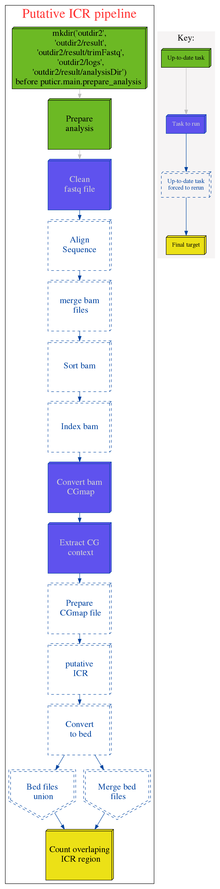

=======
puticr
=======

.. image:: https://img.shields.io/pypi/v/puticr.svg
        :target: https://pypi.python.org/pypi/puticr

.. image:: https://img.shields.io/travis/demis001/puticr.svg
        :target: https://travis-ci.org/demis001/puticr

.. image:: https://readthedocs.org/projects/puticr/badge/?version=latest
        :target: https://puticr.readthedocs.io/en/latest/?badge=latest
        :alt: Documentation Status

`puticr` is an application to identify putative Imprint Control Regions (ICRs) from Whole Genome Bisulfite Sequencing (WGBS) data. WGBS of cells representing the gamet cells (oocyte and sperm) and the
three germ layer tissues- the endoderm, mesoderm and exoderm (i.e liver, kidney, brain, etc) is required to identify putative ICRs. 

The ICR are identified in four procidures. 

1. Identify a DNA regions that have methylated ~50% in three germ layer tissues- the endoder, mesopderm, and exoderm (eg. kidney, liver, brain etc.).
2. Identify a DNA regions that have methylated ~100% in gamet cells (oocyte and sperm)
3. Identify regions in that are methlated 50% in germ layer tissues that are fully methylated (100%) in one parental alleles and the complement parental allele should be unmethylated(0%).
   This means, identify all loci in file (1) that are either overlap in the loci of oocyte OR sperm calls (not both)

This application generates the hotspot from germ layer tissue and gamets cells. The user has to intersect the calls from germ layer tissue, oocytes and sperm calls to find all bona fide ICRs.

The project attempt to streamline the analysis with most its dependencies handled during installation. 
 
The  tools uses many python packages and other dependencies.
 
See the installation istructions. 
 
Dependencies:
1. Python >= 2.7 <- Avialable in most Unix flavors
2. graphviz <- Follow your linux destro installation procidure. 

Eg. In Ubuntu you do this:

.. code-block:: console

sudo apt-get install graphviz

Installation 
-------------
 
 See `Installation <docs/source/installation.rst>`_
 
 
Changelog
---------
 
 See `Changelog <HISTORY.rst>`_

 Detail Online Documentation
 ---------------------------

`Online documentation https://puticr.readthedocs.io/en/latest`_

Supported Python Versions
-------------------------
 
 The Project  supports the following Python versions out of the box:
 
 * Python >=2.7
 * Work only under Unix/Linux environment, not tested on MAC
 
Application routine template
----------------------------
 

   

Licenses
========
 
 The code that makes puticr is licensed under the GPL license. Feel free to use it in  your free software/open-source applications
 
 
Issues
======
 
 Please report any bugs or requests that you have using the GitHub issue tracker!
 
Development
===========

Developed using  Python 2.7.

Authors
=======
 
* Dereje D. Jima
